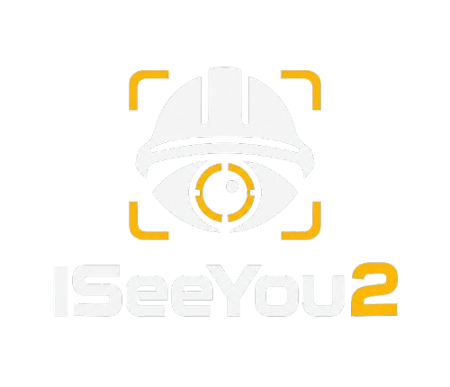

<p align="center">
  
</p>

# 🛡️ ISeeYou2 — Sistema de Visão para Segurança Industrial (AIoT) 

Última atualização: 28/09/2026

> Sistema de segurança industrial que integra Inteligência Artificial e Automação (AIoT) para prevenção de acidentes. O ISeeYou2 identifica em tempo real a ausência de Equipamentos de Proteção Individual (EPI) por visão computacional e, na etapa de integração, sinaliza e pode interromper o funcionamento de uma máquina por meio de um contato seco lido por um CLP.
>
> Foi pensado como **camada complementar de supervisão**: não substitui proteções físicas nem procedimentos de segurança, e não é um dispositivo de segurança certificado.

**Status:** 🚧 Em desenvolvimento — módulo de visão computacional funcional e em testes de campo. A integração com hardware (Arduino / CLP) ainda não foi iniciada.

---

## 📌 Sobre o projeto

O sistema funciona em um pipeline contínuo:

```
Câmera (celular / webcam / IP)
   → YOLO11 EPI + YOLO11-pose (Python/OpenCV)
   → Regras + janela de tolerância temporal
   → Escalonamento de avisos
   → Serial USB (heartbeat) → Arduino → Relé (contato seco)
   → Entrada digital do CLP (Ladder) → Fail-Safe → Contator → Máquina
                                             ↑
                                   Botoeira de Emergência
```

**Por que Arduino + contato seco, e não Modbus TCP:** o principal motivo é que o CLP que tenho disponível não tem Modbus, então essa via não seria possível. Além disso, o contato seco funciona com praticamente qualquer CLP que tenha uma entrada digital, o que amplia a compatibilidade do projeto.

**O caminho de segurança é local** (PC → Arduino → relé → CLP) e não depende de internet. O acesso remoto (Tailscale) serve só para visualização e demonstração.

## ✅ O que já funciona

- **Detecção de EPI:** capacete, óculos, luvas e colete, com YOLO11s treinado por transfer learning no dataset SH17.
- **Regras de violação:** mão nua (`hands` sem `gloves`), cabeça sem capacete, rosto sem óculos e pessoa sem colete, decididas pela sobreposição das caixas detectadas.
- **Janela de tolerância temporal:** o alerta só liga se a violação aparece em pelo menos 70% dos últimos 15 quadros, e só desliga quando cai a 30% ou menos. Isso evita disparos por uma detecção momentânea ou oclusão rápida.
- **Esqueleto (YOLO11-pose):** um ponto colorido no corpo indica o estado de cada regra (verde = ok, amarelo = confirmando, vermelho = alerta). É só visualização e não altera a decisão do alerta.
- **Celular como câmera:** uma página no navegador envia os quadros ao PC; o PC processa e devolve a imagem já com as detecções, por rede privada (Tailscale) com HTTPS.

## 🧩 Componentes do sistema

| Componente | Função |
|---|---|
| Câmera (celular pelo navegador, webcam ou IP) | Captura o vídeo da área de trabalho |
| YOLO11s (EPI) + YOLO11n-pose (esqueleto), Python/OpenCV | Detecta EPIs e a postura do operador em tempo real |
| Regras + janela de tolerância temporal | Decide o que é violação e evita falsos disparos por oclusão rápida ou variação de iluminação |
| Escalonamento de avisos | Aviso 1 → aviso 2 → aviso 3 → corte, com intervalos definidos; zera se o EPI reaparece |
| Arduino Nano | Recebe o heartbeat do PC por serial USB e comanda o relé; sem heartbeat, abre o relé |
| Módulo relé (contato seco) | Sinaliza ao CLP a permissão para operar |
| CLP | Lê o contato seco, roda a lógica Ladder e aciona a parada fail-safe |
| Botoeira de Emergência (NR-12) | Corte manual direto, independente do processamento de IA |
| Quadro elétrico | Organiza e protege a distribuição de energia (24V/220V) |
| Contator industrial | Corta a alimentação principal da máquina. É acionado pelo CLP; o módulo de relé do Arduino não liga a carga diretamente |
| Botoeira de reset | Exige validação manual da área antes de religar |
| Sinalizador visual/sonoro | Feedback imediato do status da célula (seguro/parada) |
| Rede privada (Tailscale) + servidor HTTPS | Acesso remoto para visualização e demonstração, fora do caminho de segurança |

## 📊 Resultados atuais

| Item | Valor |
|---|---|
| Dataset | SH17: 8.099 imagens e 75.994 anotações (6.479 treino / 1.620 validação) |
| Modelo | YOLO11s, 640 px, 30 épocas, batch 8, GTX 1070 (cerca de 2,4 h) |
| mAP50 (17 classes) | 0,604 (mAP50-95: 0,388) |
| mAP50 por EPI | capacete 0,694 · óculos 0,629 · luvas 0,571 · colete 0,485 |

## 🗺️ Roadmap

- [x] Definição da arquitetura do sistema
- [x] Ambiente Python configurado (Ultralytics YOLO + OpenCV + PyTorch/CUDA)
- [x] Teste de detecção genérica (pessoa): imagem de teste e câmera ao vivo
- [x] Dataset de EPI: SH17 (público), redimensionado e dividido em treino/validação
- [x] Fine-tuning do modelo YOLO11s para classes de EPI 
- [x] Regras de violação e janela de tolerância temporal
- [x] Rastreamento de esqueleto (YOLO11-pose) na visualização
- [x] Acesso remoto: celular como câmera, processamento no PC (Tailscale + HTTPS) e interface web mobile
- [x] Teste de campo em ambiente real 
- [ ] Medição formal em modo sombra (falsos alarmes por hora e violações perdidas)
- [ ] Coleta e anotação de dados do ambiente real (script de captura pronto) e retreino
- [ ] Escalonamento de avisos (aviso 1 → 2 → 3 → corte) no Python
- [ ] Firmware do Arduino (heartbeat via serial USB, relé, LEDs/buzzer, botão de reset)
- [ ] Aquisição dos componentes elétricos/industriais
- [ ] Lógica Ladder no CLP (leitura do contato seco e intertravamento fail-safe)
- [ ] Integração Python ↔ Arduino ↔ CLP (contato seco)
- [ ] Montagem do quadro elétrico e circuito de segurança 
- [ ] Testes integrados de ponta a ponta 

## 📅 Log de desenvolvimento

| Data | Atualização |
|---|---|
| _(01/09/2026)_ | Criação do repositório e definição da arquitetura |
| _(17/09/2026)_ | Ambiente Python/CUDA, dataset SH17 preparado, treino do YOLO11s (mAP50 0,604), servidor remoto (celular → PC → celular) |
| _(21/09/2026)_ | Esqueleto (YOLO11-pose), interface web para celular e envio de quadros em pipeline |


---

**Dataset:** [SH17](https://github.com/ahmadmughees/SH17dataset), licença CC BY-NC-SA 4.0 (uso não comercial).

> Este é um projeto autoral em desenvolvimento, documentado publicamente para fins de aprendizado e portfólio técnico.
